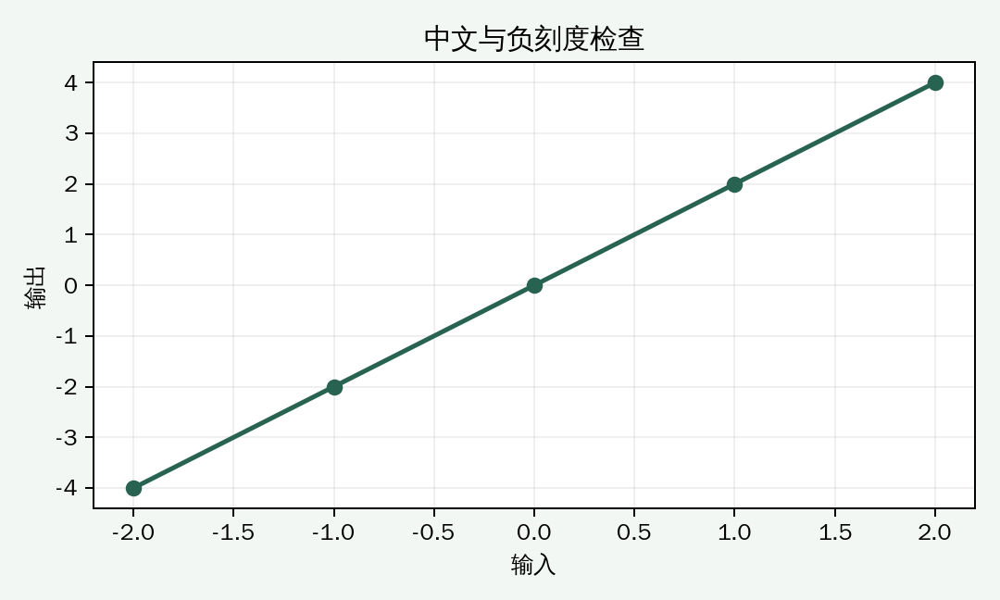

把字体名称写进 `rcParams` 之前，先确认系统里确实装有该字体。指定不存在的 `SimHei` 不会让 Matplotlib 自动安装黑体。

## 从已安装字体中选择

```python
import matplotlib.pyplot as plt
from matplotlib import font_manager

candidates = [
    "Microsoft YaHei", "SimHei", "Noto Sans CJK SC",
    "WenQuanYi Zen Hei", "WenQuanYi Micro Hei",
]
installed = {font.name for font in font_manager.fontManager.ttflist}
font_name = next((name for name in candidates if name in installed), None)

if font_name is None:
    raise RuntimeError("请先安装一种中文字体，再重新运行。")

plt.rcParams["font.sans-serif"] = [font_name, "DejaVu Sans"]
```

字体名称因操作系统而异。安装新字体后，如果当前 Python 会话仍未识别，可以先重启会话。

## 检查负号

Matplotlib 的负刻度默认使用 Unicode 负号。如果所选字体缺少这个字符，可以改用 ASCII 连字符：

```python
plt.rcParams["axes.unicode_minus"] = False
```

这个设置只处理刻度负号，不会解决中文缺字。[Matplotlib Unicode minus 示例](https://matplotlib.org/stable/gallery/text_labels_and_annotations/unicode_minus.html)

## 用小图验证

```python
fig, ax = plt.subplots(figsize=(6, 3.6))
ax.plot([-2, -1, 0, 1, 2], [-4, -2, 0, 2, 4], marker="o")
ax.set(title="中文与负刻度检查", xlabel="输入", ylabel="输出")
ax.grid(alpha=0.2)
fig.tight_layout()
fig.savefig("font-check.png", dpi=180)
```



保存图片后同时检查标题、轴标签与负刻度。数组处理和绘图经常一起使用，相关笔记：[[notes/numpy-reshape|理解 NumPy reshape：形状改变，元素如何排列]]。
