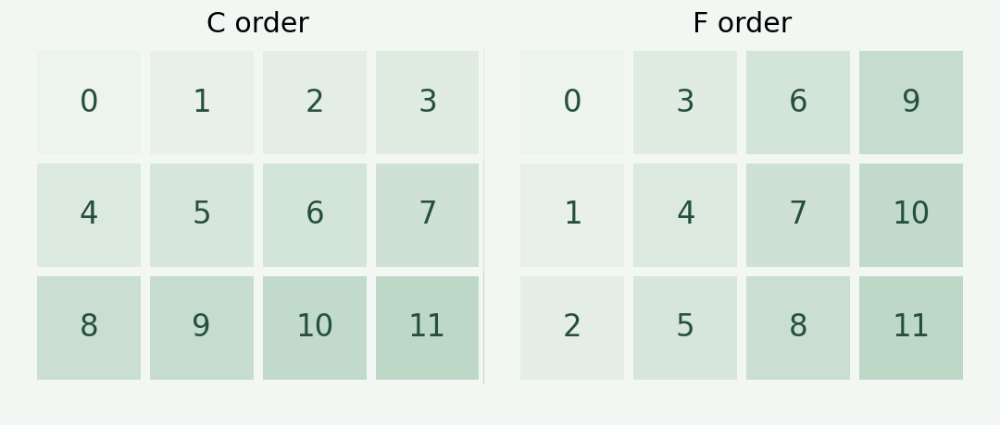

`reshape` 为数组指定新形状。先检查元素总数，再考虑元素的读取与填充顺序，通常比记忆“行、列、层”更容易理解。

## 元素数量必须一致

```python
import numpy as np

x = np.arange(12)
a = x.reshape(3, 4)
print(a)
```

输出为：

```text
[[ 0  1  2  3]
 [ 4  5  6  7]
 [ 8  9 10 11]]
```

新旧形状的各维长度乘积必须相等：

$$
\prod_{i=1}^{k} d_i = N
$$

这里 $N=12$，所以 `(3, 4)`、`(2, 6)` 和 `(2, 2, 3)` 都是可行形状。

## 用 -1 推断一个维度

```python
b = x.reshape(3, -1)
assert b.shape == (3, 4)
assert np.array_equal(a, b)
```

一次最多指定一个 `-1`。数组长度和其他维度确定后，这个维度可以自动计算出来。

## C 与 F 是索引顺序

```python
c = x.reshape(3, 4, order="C")
f = x.reshape(3, 4, order="F")

print(f)
# [[ 0  3  6  9]
#  [ 1  4  7 10]
#  [ 2  5  8 11]]
```

`C` 顺序中，最后一个轴的索引变化最快；`F` 顺序中，第一个轴变化最快。`order` 描述读出与放回元素的索引顺序，不能简单等同于输入数组的实际内存布局。[NumPy reshape 文档](https://numpy.org/doc/stable/reference/generated/numpy.reshape.html)



> [!note] 是否复制数据
> `reshape` 在可行时返回视图，必要时也可能复制数据。不要仅凭函数名称判断两个数组是否共享内存。

本页图片由上面的数组生成。若绘图时遇到中文方块或负号显示问题，参见 [[notes/matplotlib-chinese-fonts|Matplotlib 中文与负号显示：先检查字体]]。
