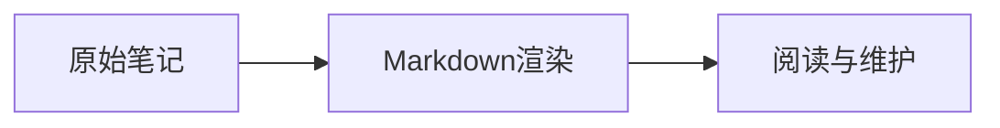

# 统一 Mermaid 阅读与编辑预览

公开文章、认证私密文章和 Markdown 编辑预览共用 `admin/mermaid-viewer.mjs`。这是基于现有 Mermaid 11.17.2 实现的相似阅读体验，不是嵌入 Codex 的内部 Markdown 阅读器。

## 使用

继续在原文中使用标准的 `mermaid` 围栏，无需转换笔记内容：

````markdown

````

图表提供缩小、适应大小、放大、展开、复制源码和下载 SVG。桌面支持拖动、键盘方向键和加减键；正文内普通滚轮继续滚动文章，Ctrl/Command 加滚轮缩放。展开面板支持滚轮缩放及触屏拖动、双指缩放，Escape 或关闭按钮退出，键盘焦点在弹层内循环并返回原按钮。SVG 是矢量导出，不是截图。

浅深模式使用统一的灰蓝节点、文字、连线和时序图配色；字体继承站点中文与英文字体设置。正文里的图表不会持续播放内置边缘动画。窄屏工具栏可以换行，不扩大页面宽度。较大图表可展开后查看。

## 构建与模块边界

| 文件                                   | 职责                                                   |
| -------------------------------------- | ------------------------------------------------------ |
| `admin/mermaid-loader.mjs`             | 按需加载同源稳定模块入口，失败可重试                   |
| `admin/mermaid-viewer.mjs`             | 串行渲染、SVG 净化、主题观察、阅读控件及生命周期       |
| `admin/mermaid-theme.mjs`              | 固定安全配置和浅深配色                                 |
| `admin/mermaid-svg-style.mjs`          | SVG CSS 转义解码、外部资源过滤、移除 keyframes         |
| `styles/mermaid-viewer.css`            | 正文、Shadow DOM 预览与全屏弹层共用样式                |
| `scripts/lib/mermaid-reader.inline.js` | Quartz 公开页面的 SPA 适配器                           |
| `admin/private-notes.mjs`              | 认证私密阅读 epoch 与取消、源码清理                    |
| `admin/preview.mjs`                    | 编辑器原文解析、当前编辑上下文和有界图表缓存           |
| `scripts/build-mermaid-viewer.mjs`     | 输出同源 ESM 入口、哈希文件及 Mermaid 按类型加载的分块 |

构建将稳定入口写为 `maintenance-assets/mermaid-viewer.js`，它转出带内容哈希的组件；Mermaid 引擎和图表类型也按需从同源 `mermaid-chunks/` 加载。三个使用端因此共享同一浏览器模块及串行渲染队列，避免不同主题的全局 Mermaid 配置互相覆盖。此功能没有增加框架或运行时依赖，也不需要 CDN 上的 Mermaid 脚本。

维护 manifest 记录 `mermaidViewerEntry`；管理与维护版本哈希包含该值。发布沿用先部署 Static Assets、保留旧哈希文件，再同步 D1 页面壳的顺序。不要只更新 D1 HTML 而遗漏组件分块。

## 安全与清理

原始文章内容不改写。公开页面和私密正式 compiler 传递已有 `data-clipboard` 源码，复制不把渲染后的 SVG 当作 Markdown。图表源码和预览缓存仅在当前页面或编辑器内存中保存，不新增持久私密全文缓存。

固定 `securityLevel: strict`、`htmlLabels: false`，图表内配置不能改安全等级、主题 CSS、字体或尺寸预算。渲染前先限制 50,000 字符，并检查真实解析后的 flowchart DB，拒绝图片节点，包括 YAML 转义属性；这类节点会在 Mermaid 测量阶段请求图片，事后净化不足以阻止。需要图片时仍在普通正文中插入。

显示和 SVG 下载都经过 DOMPurify 及额外 SVG CSS 净化：禁止脚本、foreignObject、图片和 SVG 动画，移除非本地 href，CSS URL 只保留 SVG 内片段引用。CSS 转义及注释必须先处理，不能只匹配字面 `url`。Mermaid 内置 keyframes 单独剥离，保留普通节点颜色和文字对齐，不能因为内置动画规则而丢掉整张图的样式。

私密阅读或编辑上下文结束时 AbortSignal 同步移除隐藏测量 DOM，旧渲染不会重新插入图表；控件、观察器、全屏弹层、临时下载 URL 与源码引用一起清理。公开 SPA 继续使用既有测量容器保护：正文 morph 期间保留连接中的测量节点，待在途渲染结束自行清理。不要混用这两种生命周期。

## 验收

运行已有 `npm run check`、`npm run test:publish`、`npm test -- --test-concurrency=1`、`npm run build:cloudflare`、`npm run verify:site`。针对修改的回归包括公开 SPA、预览缓存/取消、认证私密 epoch、主题对比度和 CSS 资源过滤。

实际浏览器还要检查 390、768、1440px 浅深模式，节点非黑色、CSS 非空、标签正确居中、无横向溢出；展开、拖动、复制、实际 SVG 下载、Escape/Tab、主题切换、内部导航返回以及关闭或退出后的清理。安全测试只能用合成内容，拦截外部测试域名并检查零请求，不能用真实私密正文或生产写入测试。

以本次实际执行为准，记录未覆盖的浏览器与设备；浏览器模拟不能替代真实 Android/Safari 硬件检查。

组件保留 Quartz Community 的 MIT 许可说明，构建产物包含相应版权及许可文本。
