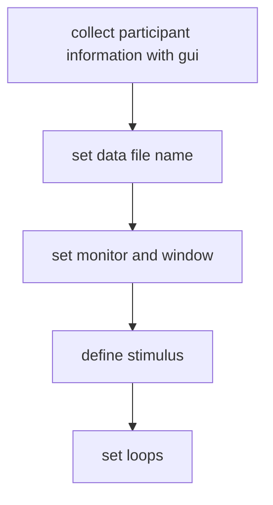
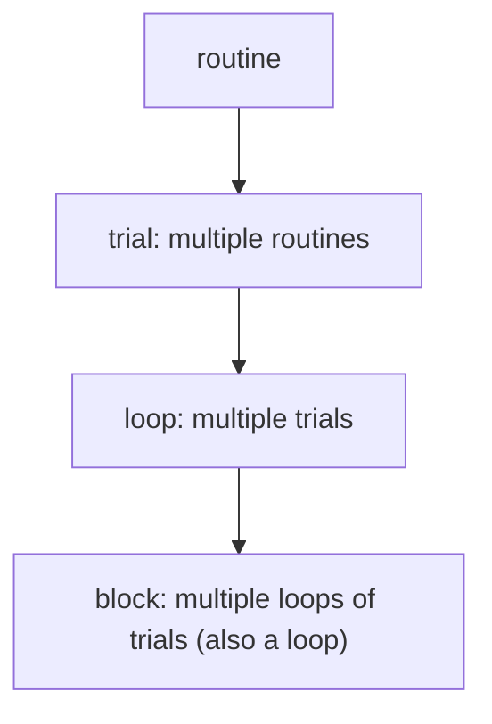

# coder

官网

[https://psychopy.org/index.html](https://psychopy.org/index.html)

资料网站

[https://psychopy.org/coder/index.html](https://psychopy.org/coder/index.html)
# 实验基本流程：

1.  导入库
2.  设置信息收集内容
3.  设置 trial 结构
4.  设置窗口
5.  设置刺激
6.  呈现刺激
7.  收集反应
8.  输出结果

## coder 的编写流程

## psychopy 实验层级

# 流程控制
## continueRoutine
默认值为 `True`，设置 `continueRoutine = False`，可结束当前 routine

## Loop.finishd

控制循环对象(Loop 为循环名)，默认值为 `False`, 当设置 `Loop.finished = True` 时，跳出循环

## nextEntry
调用某 routine 的 `nextEntry()` 方法，可以在当前 routine 结束时，进入该 routine

## 组件的 status

1. **NOT_STARTED (0)**:
    - 组件尚未开始。这是组件在实验开始之前的默认状态。
2. **STARTED (1)**:
    
    - 当组件已经开始运行时，其状态变为STARTED。这通常意味着组件（如刺激、声音或视频）正在被呈现或正在进行中。
3. **STOPPED (2)**:
    - STOPPED 状态表示组件已经停止运行。这可能是因为已经完成了预定的运行时间，或者因为通过代码或其他条件显式地停止。
4. **FINISHED (3)**:
    - 通常用于循环，表示循环已经完成了所有迭代。它不常用于单个组件，但在处理循环逻辑时非常重要。
5. **PAUSED (4)**:
    - 这个状态表示组件已被暂停。这不是 PsychoPy 中默认的组件状态，但可能在某些自定义实现中用到，用于表示组件暂时停止但尚未完全结束。

# 跨设备设置

键盘组件 --> 鼠标组件

添加 valid click