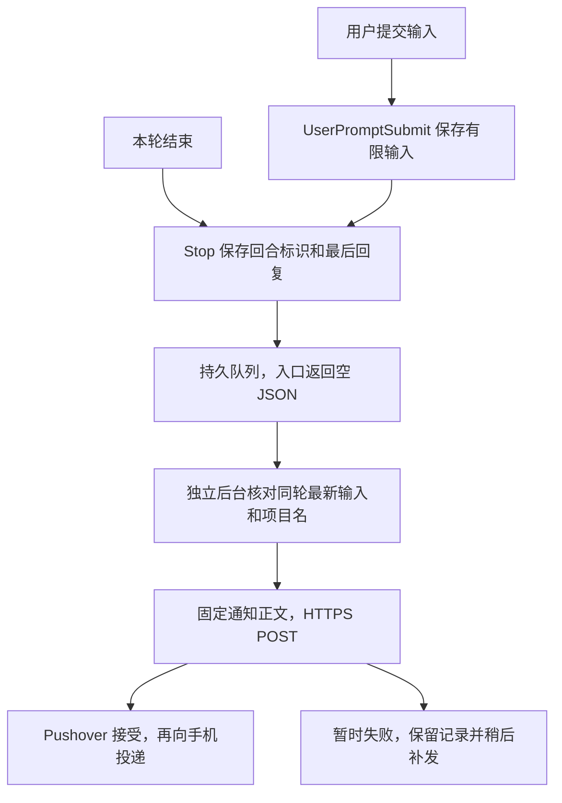

本文包含当前方案、两次故障修复和终端切换说明。把本文带到另一台电脑，在那台电脑的 Codex 桌面聊天中发送[文末完整提示词](#9-交给-codex-的完整提示词)，即可让它从零编写程序并配置。无需携带旧源码，也不用复制旧机器的配置、信任记录或队列。

你需要在本机填写 Pushover 凭据、审核新增 hooks，并确认手机接收。本文中的管理命令需等目标电脑完成安装后才能运行。

## 1. 手机显示什么

主聊天正常结束一轮后，发送一条通知。标题固定为 `Codex 本轮已结束`，正文如下：

```text
项目名称：数据分析项目
用户输入：
请检查数据中的缺失值。
本轮回复：
发现三列存在缺失值，具体如下……
```

用户输入与回复属于同一回合。该轮工作中追加过要求时，程序尝试读取最后一条实际用户输入；桌面问答卡片显示你填写的答案。回复取该轮最后一条助手消息，中间进展、工具输出和附件本体不加入通知。

输入默认最多显示 200 个 Unicode 字符，整条正文最多 1024 个字符，超长部分截断并标注，每轮只发一条。Markdown 按普通文本发送，可能保留星号等标记。[Pushover API](https://pushover.net/api)

手机和电脑各自联网即可，不需要 Codex Remote 连接。回合结束不表示任务通过验收；主动中断、强制关闭或应用崩溃，也不能保证产生正常 Stop 通知。

## 2. 原理：先保存，再由后台发送



### 快速入口与独立后台

`UserPromptSubmit` 和 `Stop` 从 stdin 接收官方 JSON，只做快速本地读写，正常返回 `{}`、退出码 0，超时上限为 3 秒。它们不访问网络，也不要求 Codex 继续运行或阻止回合结束。[Codex Hooks 文档](https://learn.chatgpt.com/docs/hooks)

后台每 2 秒检查待发记录，负责读取本机输入、查询项目名、发送和重试。它独立于聊天和临时异步 hook，关闭 Codex 后仍可处理队列。电脑关机、休眠或未登录时不能即时发送，后台恢复后再处理保留记录。

### 精确关联输入和回复

`session_id` 标识聊天，`turn_id` 标识其中一轮。关联与去重使用同一组合键：

```text
id = SHA256(JSON.stringify([session_id, turn_id]))
```

后台首次发送前，核对本机聊天记录（transcript）中该回合最后一条用户文字：先验证文件的会话标识，再验证消息中的明确回合标识及用户文字类型。环境、页面上下文和其他回合均排除，只返回最多 1025 个字符的输入预览。

这一步能处理开始时 hook 漏捕获，以及工作中追加输入。后台读取失败或遇到未知格式时，退回同一回合的 hook 记录；两者都没有才显示 `未捕获该轮用户输入`，不会取上一轮问题。空输入与未捕获分别标注。

transcript 格式并非稳定接口，升级后可能需要适配。本机从文件末尾开始扫描，最多 64 MiB，单行上限 8 MiB，扫描限时约 2.5 秒，后台子进程总超时 6 秒。超出这些范围时仍按上述规则降级。[官方说明](https://learn.chatgpt.com/docs/hooks#common-input-fields)

Stop 原子发布完整记录，同一事件并发到达只保留一份。后台另有独占锁，首次请求前固定正文，之后重试沿用同一份内容。仅处理主聊天，不发送子代理完成通知。

### 接口接受与失败处理

发送地址为 `https://api.pushover.net/1/messages.json`。请求体包含 `token`、`user`、`title`、`message` 和 `priority=0`，使用 HTTPS 和 TLS 验证，绝对网络超时为 10 秒，不启用紧急重复响铃。[Pushover API](https://pushover.net/api)

| 结果 | 后台处理 |
| --- | --- |
| HTTP 200 且响应 status=1 | 记录 `Pushover已接受并入队`，后续本地重复事件不再发送 |
| 网络错误或 5xx | 保留待发记录，先等至少 5 秒、30 秒重试；持续失败后每 15 分钟探测一次 |
| 4xx，包括凭据错误、额度不足，或明确拒绝 | 暂停发送，修正原因后恢复，避免盲目重试 |

接口接受不等于手机已收到，接收情况由你确认。响应丢失或接口接受后本机落盘前崩溃，仍可能导致重试重复；本地去重不能保证网络严格只发一次，也不负责不同电脑之间的去重。

## 3. 在另一台电脑从零配置

### 第一步：确认真实桌面环境

让 Codex 识别系统、桌面版本、实际引擎、Windows／WSL 后端、用户配置目录、已有运行时和后台机制。终端 CLI 的版本不能代替桌面版本。

必须确认桌面支持用户级 `UserPromptSubmit` 和 `Stop`，且真实事件提供可精确关联的回合标识。不支持时说明限制，不把 CLI 配置成功当作桌面已生效。

### 第二步：建立私有目录并备份

Windows 建议使用 `%LOCALAPPDATA%\CodexPushover`，放在项目、Git 和云盘之外，权限仅授予当前用户。macOS／Linux 使用用户私有目录，目录权限 700、凭据文件权限 600。

修改前备份相关配置，记录原文件是否存在，保留其他 hooks、notify 和设置。已有通知安装应增量更新，保留凭据、待发记录和接受状态，避免重复注册。

### 第三步：在本机填写凭据

在 [Pushover 账户页面](https://pushover.net/)取得 User Key，在[应用页面](https://pushover.net/apps/build)取得 Application/API Token。程序创建独立的 `credentials.json`：

```json
{
  "PUSHOVER_APP_TOKEN": "",
  "PUSHOVER_USER_KEY": ""
}
```

Windows 可在本地编辑器中填写：

```powershell
notepad.exe (Join-Path $env:LOCALAPPDATA 'CodexPushover\credentials.json')
```

真实值不发到聊天，也不写进命令参数、日志或仓库。如果用两行文本导入，第一行是应用 token，第二行是 User Key；只向 Codex 提供该文件的准确路径。保护源文件，导入完成后可删除。

后台直接读取凭据文件，不依赖终端临时环境变量。凭据尚未填写时，先完成其他配置和本地测试，再等待真实发送验证。

### 第四步：生成程序，使用稳定运行时

让 Codex 用已有运行时编写输入捕获、Stop 入队、独立后台发送和管理工具，优先使用标准库。同时生成显示选项、安装记录、测试和 Markdown 说明。

运行时要放在稳定位置。本机曾因 Codex 更新删除缓存里的 Node，导致 hooks 和后台一起失效；现在统一使用通知私有目录中的 `runtime\node.exe`。如果目标电脑只有 Codex 缓存运行时，应核实依赖，复制所需文件到私有目录，记录来源与版本并测试运行。以后维护这个自用运行时，也要在发送空闲时备份、替换和验证。

Windows 调用 WSL 时要实测参数传递。当前 `wsl.exe` 会拒绝空参数并返回 `Wsl/Service/E_INVALIDARG`，本方案改用非空占位参数。GUI 版 Node 在 PowerShell 中需要显式等待执行结束；读取中文 JSON 要指定 UTF-8。

### 第五步：注册用户级后台

本机任务计划程序拒绝注册（0x80070005），最终使用当前用户登录启动项：

```text
HKCU\Software\Microsoft\Windows\CurrentVersion\Run\CodexPushoverSender
```

它通过 VBS 隐藏启动独立 Windows Node 进程。本机没有成功安装的计划任务，也没有额外崩溃监督服务；进程被杀死后，需执行 Enable／Restart 或在下次登录时启动。

新电脑应选择实际可用的用户级机制，macOS 可适配 LaunchAgent，Linux 可适配 systemd 用户服务。这些平台尚未实装验证。升级已有程序时，确认没有真实在途请求再重启，保持 hook 入队开启。

### 第六步：审核新增 hooks

当前已验证桌面版本的入口为 `设置 → Hooks`，刷新后查看：

- UserPromptSubmit：`保存 Pushover 本轮用户输入`，命令末尾为 `capture-prompt`。
- Stop：`保存 Pushover 待发通知`，命令末尾为 `stop`。

查看定义后信任这两项。也可在输入框旁 `Review hooks` 中选中它们，点击 `Allow selected`。其他版本以实际界面为准。[官方审核说明](https://learn.chatgpt.com/docs/hooks)

安装者随后应从实际桌面后端确认两项均为用户级、启用、同步、受信任，且没有重复注册或解析错误。不要代写 trusted_hash，也不要复制旧电脑的信任记录。命令变化后是否需要重新审核，以桌面实际状态为准。

## 4. 怎样判断安装成功

Windows 安装完成后，管理工具约定为 `Manage.ps1`：

```powershell
$manager = Join-Path $env:LOCALAPPDATA 'CodexPushover\Manage.ps1'
powershell.exe -NoProfile -ExecutionPolicy RemoteSigned -File $manager Status
powershell.exe -NoProfile -ExecutionPolicy RemoteSigned -File $manager Test
```

Status 应报告后台运行、启动项注册、凭据格式、接受／待发数量和错误暂停状态。`credentials_ready=true` 只表示本地格式检查通过。Test 验证发送链路；本机现有 Test 没有真实桌面用户输入，出现未捕获占位也不能据此判断输入捕获失败。

真实桌面验收使用提问和回答不同的两轮任务，第一轮结束后再发第二轮：

```text
用户输入捕获A：请只回复「答复A」
```

```text
用户输入捕获B：请只回复「答复B」
```

通知应显示完整的 A／B 指令，回复分别为答复A／答复B。检查真实 `source=hook` 记录、相同 session_id 和不同 turn_id，再分别确认接口接受与手机收到。

新安装还应覆盖工作中追加输入、hook 记录缺失时的精确补读，并回放已接受的真实 Stop，确认并发重复不增加记录或发送。需要用户配合时，给出具体任务；用户要求停止测试时，记录尚未验证的项目，不把它们记为通过。

故障补发测试只在队列为空、没有真实请求时执行：

```powershell
powershell.exe -NoProfile -ExecutionPolicy RemoteSigned -File $manager RecoveryTest
```

它对单独测试记录注入一次网络失败，保留记录，在至少 5 秒后通过真实接口补发。故障注入与持续断网、注销重登是不同测试。隔离测试则覆盖问答关联、Unicode 截断、并发、超时、退避、4xx 暂停和重试正文一致。

## 5. 更换终端后还能用吗

只更换终端、运行环境和配置目录不变时，通常无需重配。hooks 直接调用固定路径的 Node，后台独立运行，凭据也不依赖终端变量。

| 变化 | 需要做什么 |
| --- | --- |
| 同一环境内更换 Bash、PowerShell、CMD 或 Zsh | 通常继续使用；这些终端未逐一实测 |
| WSL 切换到 Windows 原生后端，或换 WSL 发行版／用户 | 检查配置目录、hook 启用与信任，适配数据库及 transcript 路径，再验证问答匹配 |
| 切换到远程电脑、容器或另一台电脑 | 在目标环境重新构建或适配，本机程序不能自动覆盖它 |

当前配置提供 Windows 与 WSL 两套 hook 启动命令，但项目和追加输入读取仍依赖当前 Ubuntu-22.04 后端。切换后端后，可能还能发送通知，却读不到正确的追加输入；只测接口发送是不够的。

更换后端时还要确认 Windows 可执行文件在该环境中可调用。WSL 的 Windows 互操作被禁用时，现有 Windows Node 入口不能直接沿用。

## 6. 调整、关闭和卸载

显示选项放在运行目录的 `notification-options.json`：

```json
{
  "content_mode": "user_input",
  "user_input_max_chars": 200,
  "conversation_title_max_chars": 200
}
```

输入长度允许 8–400，改为 80 或 120 可给回复留更多空间。`content_mode` 改为 `conversation_title` 可恢复对话标题。选项用于尚未固定正文的新消息；已固定的待发通知保持原样。

沿用第 4 节的 `$manager`，把命令末尾动作替换为：

| 动作 | 用途 |
| --- | --- |
| Status / Test | 查看状态／排入发送测试 |
| Disable | 停止发送和新入队，停用期间回合不会自动补录 |
| Enable | 恢复发送，继续旧待发记录 |
| Restart | 载入程序更新，保持 hook 入队开启；仅在发送空闲时使用 |
| Resume | 修正凭据或额度问题后解除暂停 |
| RecoveryTest | 在发送空闲时验证失败补发 |
| Uninstall | 停止后台，移除本通知两个 hooks 和登录启动项，保留其他设置 |
| RestoreOriginal | 卸载并恢复安装前配置；检查点后有配置变更时拒绝覆盖 |

例如关闭通知和卸载：

```powershell
powershell.exe -NoProfile -ExecutionPolicy RemoteSigned -File $manager Disable
powershell.exe -NoProfile -ExecutionPolicy RemoteSigned -File $manager Uninstall
```

恢复原配置用 `RestoreOriginal`。若因后续配置变更而拒绝恢复，用 Uninstall 保留新设置，再对照备份手动合并。

卸载保留凭据、备份和日志。彻底清除时先卸载，再删除运行目录及凭据源文件；单独 Enable 不会重新注册已卸载的 hooks 和启动项。修改程序或总标题前先备份，在发送空闲时 Restart。

## 7. 文件与排查顺序

本机 Windows 运行目录是 `C:\Users\Administrator\AppData\Local\CodexPushover`，用户配置目录是 `C:\Users\Administrator\.codex`。新电脑以实际检测结果为准。

| 文件或目录 | 内容 |
| --- | --- |
| credentials.json | 独立的本机凭据 |
| notification.cjs、read-metadata.py、runtime | 快速入口、后台查询与固定运行时 |
| Manage.ps1、Run-worker.vbs、Register-startup.ps1 | 管理与当前用户登录启动 |
| notification-options.json | 显示选项 |
| installation.json、backups | 本机路径、安装信息、恢复检查点与备份 |
| prompts、events、state | 每轮有限问答预览、待发事件、固定正文与接受状态 |
| control.json、sender.log | 退避、错误暂停和脱敏日志 |
| 验证记录.md、各项 validation.json、测试文件 | 已验证结果、限制与隔离测试 |

日志只记录时间、摘要 ID、固定诊断、HTTP 代码和次数。队列与状态文件含有限问答正文，也应保持私有。当前实现保留事件和接受状态；若以后清理预览，仍需保留去重键。

| 现象 | 先检查什么 |
| --- | --- |
| Codex 更新后不再通知 | 固定运行时是否存在，后台是否运行，hooks 是否仍启用、受信任 |
| Test 也失败 | Status、凭据格式、HTTP 状态、sender_blocked |
| Test 成功，桌面无通知 | 实际配置层与真实 hook 事件；脚本测试不能代替桌面验证 |
| 输入缺失、出现旧输入或系统包装 | 同轮匹配、最新输入读取、WSL 参数及后端路径；不要借用上一轮 |
| 长输入没有显示完整 | 是否达到默认 200 字符上限，是否有截断标记 |
| 接口已接受，手机没显示 | Android 通知权限、网络、免打扰和 Pushover 应用内消息 |
| 恢复网络后暂未补发 | next_at，可能处于 15 分钟冷却；保留队列 |
| 项目显示目录名 | 项目元数据读取是否降级，后端结构或路径是否改变 |
| 重复通知 | 重复注册、多个发送者，以及响应丢失后的重试 |

故障期间如果 Stop 没有执行，就没有待发记录可以补发。持久队列只能恢复已经成功入队的事件。

## 8. 本机实际验证与限制

本次修复核实的环境为 Windows 11、Codex 桌面版 26.928.3736.0、WSL 引擎 0.159.2、Windows Node v24.21.0，后端为 Ubuntu-22.04。其他电脑不能直接沿用这些路径和版本结论。

两次修复已经纳入本方案：

| 故障 | 修复 |
| --- | --- |
| 桌面更新删除缓存 Node，hooks 和后台仍指向旧路径 | 复制所需运行时到私有固定路径，更新两个 hook 和后台启动位置 |
| 输入 hook 记录缺失，同轮追加要求未被原快照覆盖，WSL 空参数导致查询失败 | 后台首次发送前精确读取同轮最后一条用户文字，修正 WSL 参数，问答卡片只提取答案 |

最新验证结果：16 项 Node 测试和 7 项 Python 测试通过；A／B 两轮真实桌面输入与回复匹配，接口各接受一次，用户确认手机收到；6 次并发重复回放没有增加记录或发送。真实漏捕获回合成功补读最后一条追加输入，实际问答卡片也验证了答案提取。此前一次后台网络失败注入约 7 秒后补发成功。

工作中追加输入的手机实测按用户要求停止，没有记为通过。Windows 注销重登、持续断网恢复、原生 Windows 后端、各终端逐一切换及 macOS／Linux 部署，也尚未实际验证。本机已经正常运行，新电脑仍需完成自己的安装和验收。

## 9. 交给 Codex 的完整提示词

在目标电脑的 Codex 桌面聊天中复制下面全部内容。它自成一份任务说明，无需附带源码或本文其他部分；真实凭据始终留在本机文件中。

```text
请直接在这台电脑从零构建并配置 Codex 桌面版的 Pushover 手机通知。没有现成源码，请自行编写和保存程序、配置、后台启动文件、测试及管理工具，完成实际安装和验证，不要只给操作建议。本机可逆配置已获授权；需要我填写凭据、审核新增 hook 或确认手机接收时，先完成其他可做部分，再给出准确操作。

通知要求：主聊天正常结束一轮后发一条，标题“Codex 本轮已结束”。正文依次为项目名称、该回合最后一条实际用户输入、本轮最后一条助手回复。工作中追加输入应精确对应该轮，桌面问答卡片只显示填写的答案。输入默认最多200个Unicode字符，总正文不超过1024个字符，标签、换行和截断提示计入预算；长输入和长回复分别标注截断，不拆多条。不发送完整历史、中间工具输出或附件本体，不宣称任务验收成功。手机不依赖Codex Remote。

1. 检查真实环境并备份
识别系统、当前用户、桌面版本、实际引擎和Windows/WSL等后端、CODEX_HOME、用户配置目录、已有运行时及用户后台机制。CLI版本不能替代桌面版本。先查本机资源，必要时查 https://learn.chatgpt.com/docs/hooks 和 https://pushover.net/api 。
确认当前桌面支持用户级UserPromptSubmit和Stop，真实事件提供prompt、last_assistant_message、session_id、turn_id或经验证的等价回合标识。不支持时明确限制，不假装CLI配置已覆盖桌面。核实实际配置形状、协议及信任状态。
修改前备份相关文件，记录原文件是否存在。保留其他hooks、matcher、notify和设置，检查多层配置，避免重复注册。已有安装增量更新，保留凭据、pending及accepted状态；新电脑不复制旧机器的信任记录、安装信息或队列。

2. 创建私有文件和稳定运行时
Windows优先%LOCALAPPDATA%\CodexPushover，其他系统用用户私有目录，放在项目、Git和云盘之外。Windows只授予当前用户访问；macOS/Linux目录700、凭据600。
优先已有运行时和标准库，自行生成三个入口：输入捕获、Stop入队、独立后台发送；生成管理工具、显示选项、安装信息、隔离测试和Markdown说明。Windows用Node时约定notification.cjs、Manage.ps1，其他运行时提供等价文件和真实命令。
运行时路径必须稳定。如果只有Codex更新可能删除的缓存运行时，核实依赖后复制所需文件到通知私有目录，记录来源、版本并验证；hooks和后台统一使用固定绝对路径。维护运行时也要备份并在发送空闲时替换。
创建独立credentials.json，空字段PUSHOVER_APP_TOKEN和PUSHOVER_USER_KEY，给出准确位置及本机填写方法。真实值不得进入聊天、日志、命令参数、URL、输出或仓库。若我明确指定两行文本文件，只从该文件导入第一行应用token、第二行User Key，保护源文件并说明之后可删除；不要扫描其他文件猜凭据。
后台直接读凭据文件，不依赖终端临时变量。未填写时先完成其他配置和本地测试，再等待真实发送。

3. 快速hooks与精确输入关联
按官方协议从stdin读事件。UserPromptSubmit按真实session_id和turn_id原子保存有限输入；Stop保存同一回合标识、last_assistant_message的有限预览，以及必要的transcript路径。仅处理主聊天，排除子代理。
使用SHA256(JSON.stringify([session_id,turn_id]))或等价无歧义组合键关联和去重。缺少标识时脱敏记录并跳过，不能只按会话去重。输入缺失不能借用上一轮；空文本和未捕获分别显示。
两个同步入口只做快速本地处理，超时约3秒，正常和可处理错误返回有效JSON {}、exit 0。不要返回额外上下文、阻止结束或要求继续运行的字段。不依赖可能随回合结束取消的异步hook。
后台首次发送前核对当前版本本机transcript中该回合最后一条实际用户文字，处理hook漏捕获及工作中追加输入。必须验证文件的session_id，以及消息的明确turn_id和经过实测的用户文字类型标记。不能按最新消息、时间或位置猜回合，排除环境和页面上下文；问答卡片只提取answer。
transcript格式不是稳定接口：在当前版本适配并实测，未知格式或读取失败退回同轮hook记录，两者都没有才显示占位。扫描从末尾开始，约2.5秒、最多64MiB、单行8MiB，后台子进程总超时约6秒。只返回和保存约1025个Unicode字符预览，不保存原始stdin或完整历史。
持久化prompts、不可变events、state和control：分别保存有限输入、回合事件、固定通知正文及attempts/outcome/http/accepted_at、全局next_at/failures/blocked和凭据指纹。测试来源标test，真实hook标hook。
完整写入并落盘后原子发布，验证并发重复只保留一条。后台用独占锁，能恢复死进程旧锁；保留已接受键。首次网络请求前固定最终正文，重试不重新选输入或元数据。

4. 独立用户后台与发送
按实际系统注册可用用户后台。Windows可用用户任务或HKCU Run；被拒绝时记录原因并采用可用方案，不提升到管理员或系统账户。macOS/Linux按目标系统适配。后台独立于聊天临时进程，绝对路径启动，无额外服务器；记录是否有崩溃监督。
只读真实桌面项目分配与当前引擎元数据，优先显示桌面项目名，无项目显示“未关联项目”，降级到目录名要说明。数据库、发行版、用户名及路径在本机核实，不照抄其他电脑。损坏记录应隔离并脱敏报告，避免阻塞后续队列。
Windows调用WSL时实测参数传递，不传wsl.exe会拒绝的空参数，使用明确占位或命名参数。GUI版Node在PowerShell中显式等待，中文JSON按UTF-8读取。
HTTPS POST https://api.pushover.net/1/messages.json ，开启TLS验证，请求体传token、user、title、message、priority=0，不传紧急响铃retry/expire。绝对网络超时约10秒，限制响应大小，单发送者串行发送。
只有HTTP200且响应status=1记录“Pushover已接受并入队”。网络错误和5xx保留记录，先至少5秒、30秒重试，持续失败改为每15分钟低频探测，之后自动补发。4xx或明确拒绝暂停盲目重试，修正凭据/额度后提供恢复命令，凭据指纹变化可恢复。
处理请求期间崩溃的不确定状态。日志只记时间、摘要ID、固定诊断、HTTP代码和次数，不写凭据、问答、响应原文或敏感异常。说明响应丢失可能重复，不能保证网络严格只发一次。更新程序时确认发送空闲再重启，保持hook入队开启。

5. 审核、验证与终端兼容
隔离测试使用虚拟凭据，不调用真实接口，覆盖问答匹配、同轮追加输入、漏捕获补读、问答卡片、环境排除、跨会话/回合、Unicode截断、并发/锁、缺失字段、子代理、超时、退避、4xx暂停及重试正文一致。
新增hook需审核时，先完成具体文件和配置。状态文字设为“保存 Pushover 本轮用户输入”和“保存 Pushover 待发通知”，入口capture-prompt和stop或说明等价入口。给当前版本具体界面操作，只审核本通知两项；不要代写trusted_hash、复制旧信任或绕过审核。然后从实际桌面后端核实用户级、enabled=true、async=false、trusted，无解析错误和重复项。
先测试发送脚本，再在同一个真实桌面聊天连续两轮：第一轮“用户输入捕获A：请只回复「答复A」”，结束后第二轮“用户输入捕获B：请只回复「答复B」”。提问与回答必须不同。核对真实输入、Stop标识和正文，来源为hook，session_id相同、turn_id不同；接口接受和手机收到分别记录。
另测工作中追加输入及缺失hook记录的补读。并发回放已接受的真实Stop，确认不增加记录或发送。在队列为空、没有真实在途请求时，仅对独立test记录注入一次网络失败，检查至少5秒后自动补发；不要用Disable/Enable干扰真实桌面任务。
缺少条件或我要求停止测试时，完成其他可做工作并列出未验证项，不宣称全部通过。故障注入、持续断网、注销重登及其他后端分别记录。
说明只换终端通常无需重配，但切换Windows/WSL后端、发行版、用户、远程电脑或容器可能改变配置和输入读取路径。按目标后端提供可执行的hook命令，核实运行时调用能力；不要把发送成功当作追加输入读取成功。未实测的终端或后端明确列出。

6. 交付、显示选项和恢复
生成实际管理工具。Windows约定Manage.ps1支持Status、Test、Disable、Enable、Restart、Resume、RecoveryTest、Uninstall、RestoreOriginal；其他系统提供等价真实命令。Status报告后台、启动项、凭据格式、队列和暂停状态。Test可生成有限示例问答，但不能冒充真实桌面输入测试；RecoveryTest只对test记录注入一次失败。
notification-options.json默认content_mode=user_input、user_input_max_chars=200、conversation_title_max_chars=200，输入长度允许8–400，可切换conversation_title。标签、换行及截断标记计入1024字符预算，已固定正文不受后续选项修改影响。
installation.json记录实际路径、后台注册、稳定运行时来源版本、备份、两个通知命令和恢复检查点。保存Markdown说明、完整修改文件列表、验证结果及未验证项目。
Disable停止新入队和发送，停用期间回合不自动补录；Enable处理旧pending。Uninstall只移除本通知hooks和后台启动，保留其他设置。RestoreOriginal用安装后检查点防止覆盖后续改动，冲突时拒绝覆盖并给保留设置的卸载方式。先卸载，再删除目录及凭据源；说明单独Enable不重建已卸载配置。
说明问答文件的隐私范围、清理对去重的影响、休眠/关机/未登录、后台崩溃、Stop未触发和Codex更新的限制。未入队的漏通知不能承诺自动补发。

请从环境检查开始完成。最终分别说明已生成、已安装、隔离测试通过、真实桌面触发、接口接受、手机确认这几种状态；任何未验证项目都如实列出。
```
