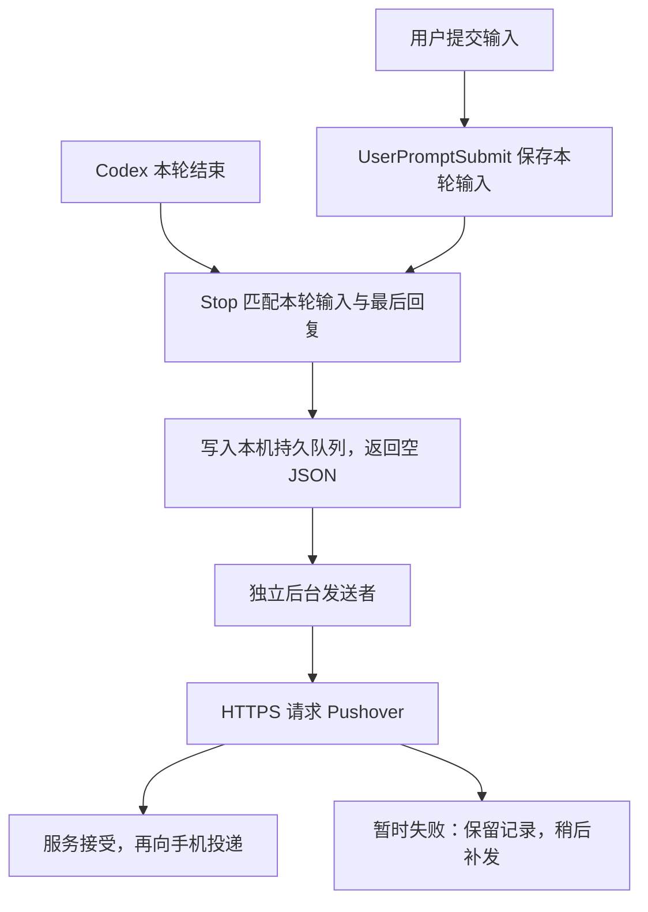

# Codex 桌面版手机通知：从零配置指南

2026-10-01 · Pushover 方案

只需把本文带到新电脑，在 Codex 桌面版的本机聊天中发送[文末提示词](#9-交给-codex-的完整提示词)。Codex 会根据目标电脑从零生成程序、配置、测试和后台任务。你负责在本机填写凭据、审核新增 hooks，并确认手机接收。

## 1. 通知显示什么

主聊天每轮结束后，手机收到一条标题为 `Codex 本轮已结束` 的通知：

```text
项目名称：数据分析项目
用户输入：
请检查数据的缺失值。
本轮回复：
发现三列存在缺失值，具体如下……
```

用户输入与回复属于同一回合。回复取该轮最后一条助手消息；中间进展、工具输出和附件本体不加入通知。回合结束也不代表任务通过验收。

输入默认显示最多 200 个字符，整条正文最多 1024 个 Unicode 字符，超长部分截断并标注。Markdown 按普通文本发送，所以星号等标记可能保留。手机与电脑各自联网即可，不需要 Codex Remote 连接。

## 2. 它怎样工作



### hooks 只负责本地处理

`UserPromptSubmit` 读取输入，`Stop` 读取最后回复。两个入口都从 stdin 接收官方 JSON，完成本地处理后返回 `{}`、退出码 0，超时上限为 3 秒。网络请求和项目元数据查询由独立后台完成，因此网络等待不会拖住 Codex 结束。

本方案不使用会话里的临时异步 hook。后台每 2 秒检查磁盘队列；关闭 Codex 后仍可继续发送。电脑休眠、关机或未登录时不能即时通知，下次后台启动后再处理保留的待发记录。

当前协议和审核要求见 [Codex Hooks 文档](https://learn.chatgpt.com/docs/hooks)。新电脑应先查桌面实际版本，不能只凭终端 CLI 配置成功就认定桌面生效。

### 用会话和回合匹配问答

session_id 标识聊天，turn_id 标识其中一轮。关联和去重都使用这两个标识：

```text
id = SHA256(JSON.stringify([session_id, turn_id]))
```

输入 hook 和 Stop 必须得到同一键。缺少该轮输入时显示 `未捕获该轮用户输入`，不会借用上一轮问题；缺少必要标识时跳过并记录脱敏诊断。

Stop 先写完整临时文件并落盘，再原子发布事件；同一事件并发到达只保留一份。后台另有独占锁，避免两个发送者同时工作。首次发送前固定正文，重试沿用同一份问答。当前实现只通知主聊天，过滤子代理事件。

### 项目名与错误处理

后台只读桌面项目分配和当前引擎元数据，优先显示桌面项目名。未关联项目显示 `未关联项目`，读取失败时可退回目录名，并报告降级。内部数据库结构会随版本变化，新电脑需要重新核实，查询超时设为 2 秒。

发送使用 HTTPS POST，请求体包含 token、user、title、message 和 priority=0，开启 TLS 验证，绝对超时 10 秒，不启用紧急重复响铃。HTTP 200 且 status=1 才记录 `Pushover已接受并入队`。[Pushover API](https://pushover.net/api)

| 结果                                    | 后台处理                                                     |
| --------------------------------------- | ------------------------------------------------------------ |
| 网络错误或 5xx                          | 保留记录，先等待至少 5 秒、30 秒重试；继续失败后每 15 分钟探测一次 |
| 4xx，包括凭据错误、额度不足；或明确拒绝 | 暂停队列，修正原因后恢复                                     |
| 接口接受                                | 保存接受状态，后续重复事件不再发送                           |

接口接受后仍要由你确认手机收到。响应丢失或接受后落盘前崩溃，可能造成重试重复；本地去重不能保证网络严格只发一次，也不能在不同电脑之间去重。

## 3. 在新电脑配置

在目标电脑安装并打开 Codex 桌面版，让它按文末提示词依次完成以下步骤。本文中的文件名和管理命令是新程序需要实现的约定；安装完成后才能运行。

### 第一步：确认桌面支持

让 Codex 检查系统、桌面版本、实际引擎、Windows/WSL 后端、用户配置目录和已有运行时；确认支持用户级 `UserPromptSubmit` 与 `Stop`，且事件提供可关联的回合标识。当前版本不支持时，应先说明限制。

新电脑的用户名、WSL 发行版、运行时缓存路径和数据库位置都可能不同。macOS/Linux 还需更换用户级后台机制，例如 LaunchAgent 或 systemd 用户服务，不能直接运行 Windows 脚本。

### 第二步：创建私有目录并备份

Windows 推荐使用 `%LOCALAPPDATA%\CodexPushover`，不放进项目、Git 或云盘。修改前备份现有配置，保留其他 hooks 和设置。新电脑生成自己的程序和安装信息。若目标目录已经存在，先检查和备份，保留有效凭据、待发队列及接受状态。

Windows 目录权限只授予当前用户；macOS/Linux 使用私有目录权限 700、凭据文件权限 600。

### 第三步：在本机填写凭据

在 [Pushover 账户页面](https://pushover.net/)取得 User Key，在[应用页面](https://pushover.net/apps/build)取得 Application/API Token，填入私有运行目录的 `credentials.json`：

```json
{
  "PUSHOVER_APP_TOKEN": "",
  "PUSHOVER_USER_KEY": ""
}
```

Windows 可打开本地编辑器：

```powershell
notepad.exe (Join-Path $env:LOCALAPPDATA 'CodexPushover\credentials.json')
```

不要把真实值发到聊天或命令行。如果使用两行文本导入，只指定该文件的准确位置，导入后可删除源文件。后台直接读凭据文件，不依赖终端临时变量。

### 第四步：生成程序和管理工具

让 Codex 使用已有运行时编写程序，优先采用标准库。程序至少提供三个入口：输入捕获、Stop 入队、独立后台发送。Windows 可生成 `notification.cjs`、`Manage.ps1` 和用户后台启动文件；其他系统按本机运行时生成等价文件。

输入记录、待发事件、接受状态和全局退避分别持久化。写入必须原子化，后台只能有一个发送者；损坏记录应隔离并报告，不能让它持续挡住整个队列。先在隔离目录完成测试，再连接真实接口。

同时生成 `notification-options.json`、`installation.json`、使用说明和验证记录。凭据文件保持独立，安装信息记录实际路径、备份及恢复检查点。

### 第五步：注册独立后台

本机用当前用户登录启动项 `HKCU\Software\Microsoft\Windows\CurrentVersion\Run\CodexPushoverSender`，经 VBS 隐藏启动已有 Windows Node。任务计划程序曾拒绝注册，因此本机没有成功安装的计划任务。

新电脑由 Codex 选择实际可用的用户级后台，并提供查看、停用和卸载命令。若已有通知安装，升级时保留凭据、队列及接受状态，先让发送者支持新格式再启用，重启前检查发送是否空闲。

### 第六步：审核两个 hooks

让 Codex 给两个新增项设置清楚的状态文字。本机已验证版本的审核入口是 `设置 → Hooks`，刷新后查看：

- UserPromptSubmit：`保存 Pushover 本轮用户输入`，命令末尾为 `capture-prompt`。
- Stop：`保存 Pushover 待发通知`，命令末尾为 `stop`。

审核并信任这两项。也可在输入框旁的 `Review hooks` 中选中它们，点击 `Allow selected`。新版本入口以实际界面为准。

Codex 应随后从实际桌面后端确认两个项都是用户级、启用、同步、受信任，且没有重复注册。信任必须由界面完成，不能复制其他电脑的可信记录或代写 trusted_hash。

### 第七步：完成真实验证

用下一节的命令测试发送脚本，再完成两轮桌面任务，确认手机接收。

## 4. 怎样验证配置成功

Windows 安装完成后，生成的 `Manage.ps1` 应支持以下命令：

```powershell
$manager = Join-Path $env:LOCALAPPDATA 'CodexPushover\Manage.ps1'
powershell.exe -NoProfile -ExecutionPolicy RemoteSigned -File $manager Status
powershell.exe -NoProfile -ExecutionPolicy RemoteSigned -File $manager Test
```

Status 应报告后台是否运行、启动项是否注册、凭据格式是否就绪、接受/待发数量及错误暂停状态。`credentials_ready=true` 只表示本地格式检查通过。Test 生成明确标为测试的问答，走同一个队列和发送流程；接口接受后，再由你确认手机收到。

然后在同一个本机桌面聊天做两轮，等第一轮结束再发第二轮：

```text
请只回复：问答通知测试一
```

```text
请只回复：问答通知测试二
```

两轮应分别产生真实 `source=hook` 记录，session_id 相同、turn_id 不同，且每条输入和回复都与实际回合匹配。两条都被接口接受后，你再确认手机收到两条。

让 Codex 回放一条已接受的真实 Stop，检查并发重复不增加事件或发送次数。故障补发可用：

```powershell
powershell.exe -NoProfile -ExecutionPolicy RemoteSigned -File $manager RecoveryTest
```

RecoveryTest 应在队列为空、没有真实请求正在发送时，对单独测试记录注入一次网络失败。记录保留，在至少 5 秒后通过真实接口补发。这验证的是故障注入；实际断网恢复和注销重登要另做测试。

让 Codex 为新实现编写隔离测试，覆盖并发、问答关联、截断、超时和重试。若使用 GUI 版 Node，PowerShell 调用需显式等待；读取含中文的 JSON 时指定 UTF-8。测试数量由新实现决定，以实际通过结果为准。

## 5. 调整通知内容

新程序应生成运行目录下的 `notification-options.json`，安装后可编辑：

```json
{
  "content_mode": "user_input",
  "user_input_max_chars": 200,
  "conversation_title_max_chars": 200
}
```

把 `user_input_max_chars` 改为 80 或 120，可以给回复留更多空间，允许范围为 8–400。把 `content_mode` 改为 `conversation_title`，可恢复对话标题；改回 `user_input` 则显示输入。

标签、换行和截断标记都计入 1024 字符预算。新选项用于后续新消息，已经固定正文的待发记录保持原样。修改脚本中的总标题或字段格式时，先备份，再在发送空闲时执行 Restart。

## 6. 查看、关闭与恢复

沿用第 4 节的 `$manager`，将命令末尾的动作替换为下表中的名称：

| 动作            | 用途                                               |
| --------------- | -------------------------------------------------- |
| Status / Test   | 查看状态 / 排入测试通知                            |
| Disable         | 停止发送和新入队；停用期间的回合不会事后补录       |
| Enable          | 恢复发送，继续处理旧待发记录                       |
| Restart         | 载入脚本更新，保持 hook 入队开启                   |
| Resume          | 修正凭据或额度问题后解除暂停                       |
| RecoveryTest    | 在发送空闲时验证失败补发                           |
| Uninstall       | 移除本通知两个 hooks 和后台启动项，保留其他设置    |
| RestoreOriginal | 卸载并恢复安装前配置；检查点后有配置变更时拒绝覆盖 |

例如关闭通知：

```powershell
powershell.exe -NoProfile -ExecutionPolicy RemoteSigned -File $manager Disable
```

完整恢复遭拒时，先用 Uninstall 保留后来添加的设置，再对照备份合并。卸载会保留凭据、备份和日志；彻底清除时先卸载，再删除运行目录和凭据源文件。卸载后单独 Enable 不会重新登记 hooks 或登录启动项。

要求 Codex 说明后台是否有崩溃监督。若只安装登录启动项，进程被杀死后通常需要 Enable/Restart 或下次登录才能恢复。

## 7. 文件位置与常见问题

Windows 默认运行目录约定为 `%LOCALAPPDATA%\CodexPushover`。hooks 写入目标桌面实际生效的用户配置层；最终路径以 Codex 的安装交付记录为准。

| 文件                                | 保存的内容                                     |
| ----------------------------------- | ---------------------------------------------- |
| credentials.json                    | 本机真实凭据                                   |
| 通知程序、Manage.ps1 或等价管理工具 | 目标电脑生成的通知实现与管理命令               |
| notification-options.json           | 正文显示选项                                   |
| installation.json、backups          | 本机路径、注册信息、恢复检查点与原配置         |
| prompts、events、state              | 每轮有限问答预览、待发记录、固定正文和接受状态 |
| control.json、sender.log            | 退避、暂停及脱敏日志                           |

日志不记录真实凭据或问答，队列文件则含受保护的有限正文。新程序需保留去重状态，并说明历史保留方式；清理问答预览时，仍应保留已接受事件的键。

| 现象                        | 处理顺序                                                |
| --------------------------- | ------------------------------------------------------- |
| Test 也不成功               | 查后台、凭据格式、HTTP 状态和 sender_blocked            |
| Test 成功，桌面没通知       | 查实际配置层和两个 hook 的信任、启用状态                |
| 输入未捕获或串到上一轮      | 查 UserPromptSubmit 和 session_id＋turn_id 的精确匹配   |
| accepted 已增加，手机没显示 | 查 Android 通知权限、网络、免打扰和 Pushover 应用内消息 |
| 断网恢复后暂未补发          | 查 next_at，可能处于 15 分钟冷却；不要清空队列          |
| 项目显示目录名              | 重新核实项目元数据；Codex 更新可能改变结构或路径        |
| 重复通知                    | 查重复注册、多个后台及响应丢失后的重试                  |

源程序、空凭据模板和测试都由目标电脑上的 Codex 新建。文末提示词不需要额外文件或旧聊天内容。

## 8. 已验证方案与新安装的区别

此前的实装环境是 Windows 11、Codex 桌面版 26.928.2636.0、WSL 引擎 0.159.2 和 Windows Node v24.21.0。以下记录说明这套设计已有运行验证；本次文档改写没有重新安装程序。

此前已经通过的检查：13 项 Node 测试、3 项 Python 测试；两轮真实桌面问答通知均被接口接受，用户确认手机收到且匹配；6 次并发重复回放没有额外发送；一次后台失败注入约 7 秒后补发成功。安装命令也在隔离配置中检查过，保留原 hooks，重复合并不会增加通知项。

尚未实际验证 Windows 注销重登、持续断网后的恢复、原生 Windows 后端和 macOS/Linux 部署。新电脑应分别验证，不能直接沿用本机结论。当前方案也没有验证主动中断或应用被强杀会产生普通 Stop 通知。

## 9. 交给 Codex 的完整提示词

在目标电脑的 Codex 桌面聊天中复制下方全部内容即可，无需附带源码、路径模板或其他电脑的配置。凭据始终留在本机文件中。

```text
请直接在这台电脑从零构建并配置 Codex 桌面版的 Pushover 手机通知。没有现成源码或参考目录，请自行编写并保存全部脚本、配置、后台启动文件、测试和管理工具，完成实际安装与验证，不要只给建议或待复制的示例。可逆的本机配置已获授权，请持续完成；需要我填凭据、审核 hook 或确认手机接收时，给出准确操作并等待必要反馈。

通知要求：主聊天每轮结束后发送一条，标题为“Codex 本轮已结束”。正文依次显示项目名称、该轮回复对应的最近用户输入、本轮最后一条助手回复。不要加入完整历史、中间工具输出或附件本体，不把回合结束描述成验收成功。输入默认显示最多200个Unicode字符，总正文不超过1024字符；长输入和长回复分别标注截断，不拆成多条。手机无需连接Codex Remote。

1. 检查真实桌面环境
识别系统、当前用户、桌面版本、实际后端/引擎、用户配置目录、已有运行时和后台机制，检查Windows/WSL路径与CODEX_HOME。终端CLI版本不能代替桌面版本。优先读取本机资源，必要时核对 https://learn.chatgpt.com/docs/hooks 和 https://pushover.net/api 。
确认当前桌面支持用户级UserPromptSubmit和Stop，能获得prompt、last_assistant_message及真实session_id、turn_id，或经过验证的等价回合标识。不支持时具体说明限制和升级方向，不能把CLI配置成功当作桌面成功。
先确认实际生效的用户级hook文件形状与输出协议，再生成配置，不照抄其他版本示例。修改前备份文件，记录原文件是否存在；保留其他hooks、matcher、notify和设置，检查各层/插件，避免重复注册。已有通知安装应增量适配，保留凭据、待发记录和接受状态。

2. 从零生成程序、目录和凭据模板
运行目录放在项目、Git和云盘之外。Windows优先%LOCALAPPDATA%\CodexPushover，只授予当前用户访问；macOS/Linux用用户私有目录，目录700、凭据600。
使用已有合适运行时自行生成输入捕获、Stop入队和后台发送程序，优先标准库；生成管理工具、后台启动文件、隔离测试、notification-options.json、installation.json及Markdown说明。Windows使用Node时程序名notification.cjs，管理工具约定为Manage.ps1；使用其他运行时则生成对应程序，管理工具调用其实际路径。其他系统交付等价脚本及真实命令。
创建credentials.json，包含空的PUSHOVER_APP_TOKEN和PUSHOVER_USER_KEY，告诉我确切位置及本机填写方法。不要让我把真实值发到聊天，也不要在输出、日志、命令参数、URL、示例或仓库中回显。若我给出准确的两行本地文本路径，仅从该文件导入：第一行应用token，第二行User Key；禁止扫描其他文档猜凭据，保护源文件并说明导入后可删除。
后台直接读取凭据文件，不依赖终端临时变量。未填好时先完成其他安装和本地测试，再等待真实发送验证。新电脑不导入旧机器的可信记录、installation.json、日志或问答队列。

3. 实现快速hooks和精确问答关联
按官方协议从stdin读取事件。UserPromptSubmit只保存该轮有限输入，Stop取同一session_id和turn_id对应的输入与last_assistant_message，使用SHA256(JSON.stringify([session_id,turn_id]))或等价无歧义键关联和去重。缺少必要标识时记录脱敏诊断并跳过；缺少输入时显示占位，禁止借用上一轮问题。仅处理主聊天，排除子代理。
每项输入/回复最多保存约1025个Unicode字符预览，不保存原始stdin或完整历史。同一回合在Stop之前可更新最近输入，入队之后固定快照；显示预算包含标签、换行和截断提示，提供输入长度8–400的本地选项，默认200。可提供conversation_title回退模式，默认仍为user_input。
两个同步入口只做快速本地处理，设置约3秒超时，正常及可处理错误返回有效JSON {}、exit 0；不输出额外上下文，不返回阻止结束或要求继续运行的字段。网络、重试和元数据查询放后台，不依赖随会话结束可能取消的异步hook。
定义并实现持久记录：prompts按键保存有限输入；events保存不可变事件，含id、session_id、turn_id、cwd、created_at、source和有限问答预览；state保存固定通知正文、attempts、outcome、http及accepted_at；control保存next_at、failures、blocked和凭据指纹，不保存真凭据。测试事件标test，真实hook标hook。
Stop完整写入并落盘后原子发布，验证并发重复只有一条。后台有独占锁和旧锁恢复；崩溃恢复不丢待发记录，损坏记录隔离并脱敏报告，不持续卡住队列。保留已接受键，清理预览仍保留去重索引。

4. 建立独立用户后台并发送
用已有合适运行时，尽量只用标准库，无额外服务器。Windows选择确实可注册的用户级任务或HKCU Run等机制，注册被拒绝时记录原因并使用可用方案，不提高到管理员/系统账户；macOS/Linux按实际系统适配用户后台与管理命令。后台必须独立于聊天/工具的临时进程，使用绝对路径。
项目名优先读取真实桌面项目分配，仅只读必要元数据，查询限时约2秒；无项目显示“未关联项目”，目录名降级要说明。数据库结构和实际路径在本机验证，尤其不要混用Windows缓存与WSL当前引擎数据库，也不照抄他人发行版、用户名或宿主ID。
HTTPS POST到 https://api.pushover.net/1/messages.json ，TLS验证开启；请求体传token、user、title、message、priority=0，不传紧急响铃retry/expire。绝对网络超时约10秒，限制响应大小，单发送者串行发送。
只有HTTP200且status=1记“Pushover已接受并入队”。网络/5xx保留记录，先至少5秒、30秒重试，持续失败改为15分钟低频探测，恢复后自动补发。4xx或明确拒绝暂停盲目重试；修正凭据/额度后有恢复命令，凭据指纹变化可恢复。
首次请求前持久化最终正文，重试保持一致，处理请求期间崩溃的不确定状态。日志只记时间、散列ID、固定诊断、HTTP代码和次数，不写凭据、问答、响应原文或敏感异常。说明响应丢失或接受后落盘前崩溃可能重复，不能保证网络严格只发一次。
更新已有方案时先在发送空闲时加载兼容的新后台，再激活新记录格式，重启期间保持入队开启。

5. 审核与真实验证
先用虚拟凭据在隔离目录测试问答匹配、Unicode截断、并发/锁、同会话下一轮、不同会话、重复/缺失字段、子代理过滤、超时、网络退避、4xx暂停及重试正文一致。再测真实发送脚本，接口接受和手机收到分别记录。
新增hook需要审核时，先完成具体文件和配置。两个状态文字分别设为“保存 Pushover 本轮用户输入”和“保存 Pushover 待发通知”，命令入口分别为capture-prompt和stop或清楚标明的等价入口。给我当前版本准确的界面操作和实际命令，只审核本通知两项；不要代写trusted_hash、复制旧信任记录或使用绕过参数。审核后从实际桌面后端确认source=user、enabled=true、async=false、trustStatus=trusted且无解析错误或重复项；如需刷新/重启，按当前版本操作后重新核实。
真实桌面验证在同一个本地聊天连续两轮：第一轮“请只回复：问答通知测试一”，结束后第二轮“请只回复：问答通知测试二”。核对真实输入/Stop的session_id、turn_id及正文，来源为hook；下一轮仍通知，由我确认手机两条问答匹配。不要用预设文本替代实际事件。
回放一条已接受的真实Stop并并发重复，确认事件和发送次数不增加。在队列为空且无真实在途请求时，用明确标为test的故障注入检查至少5秒后自动补发。不要用Disable/Enable干扰桌面任务，也不要把模拟事件、recovered或修正文当正常桌面触发。
记录故障注入与实际断网的区别；真实断网恢复、注销重登及其他后端未测试时列为未验证。缺少实际条件或我未确认手机时，完成独立工作并列明剩余步骤，不能宣称全通过。

6. 交付和恢复
生成并保存实际可运行的管理工具。Windows约定Manage.ps1支持Status、Test、Disable、Enable、Restart、Resume、RecoveryTest、Uninstall、RestoreOriginal；其他系统给等价工具与命令。Status报告后台/启动项/凭据格式状态、队列数量和暂停状态，不能只打印注册成功。Test生成带有限示例问答的测试记录，通过正常队列发送；RecoveryTest只对独立test记录注入一次失败，不干扰真实回合。
生成notification-options.json，默认content_mode=user_input、user_input_max_chars=200、conversation_title_max_chars=200。installation.json记录目标电脑实际路径、后台注册信息、备份、两个通知命令和恢复检查点。提供本机Markdown说明、全部生成/修改文件、验证结果和待办。
Disable停止新入队和发送，停用期间回合不自动补录；Enable继续旧pending。Uninstall只移除本通知hooks和启动项，保留其他设置。RestoreOriginal记录原文件不存在情况，并用审核后的配置检查点防止覆盖后续修改；冲突时拒绝覆盖并给保留设置的卸载方式。先卸载，再彻底删除目录和凭据源。
说明显示选项、问答文件的隐私范围、历史清理对去重的影响、休眠/关机/未登录和后台崩溃的实际限制，以及Codex更新后可能需要重新适配路径和审核。

请从环境检查开始，逐项完成构建和安装。若需要我填写凭据、在桌面审核或配合真实测试，先完成其他可做部分，再给出具体操作。最终区分已生成、已安装、已通过隔离测试、已由真实桌面触发、接口已接受和手机已确认这几种状态。
```